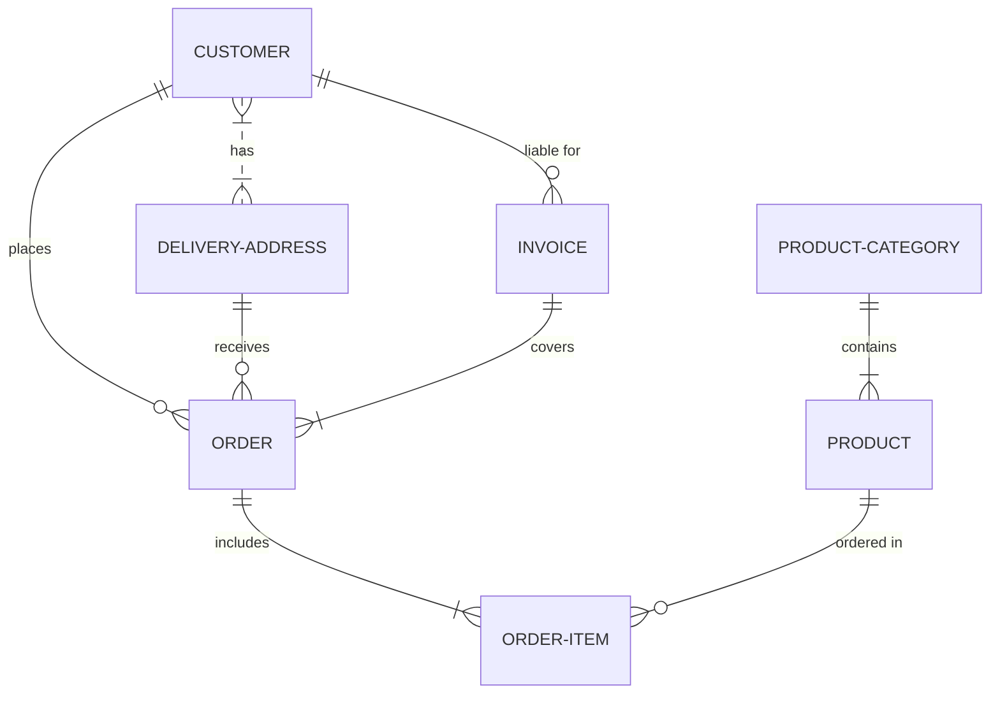

Q: is there any way to embed a mermaid file from an external URL (another file in the repository) as a
rendered mermaid file in a markdown file? I'm guessing a third party service could render it as an image
on-the-fly and it would be embedded into the markdown as an image. Seems messy though.
Another approach could be some kind of `include` tag that points to an external mermaid source,
and gets inserted into the markdown on comitting. The aim is to be able to edit a single
mermaid diagram in a file on its own, and have it appear in various markdown doc files where necessary,
and without a complex workflow to maintain.

