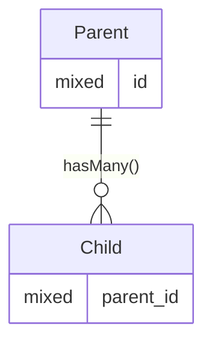
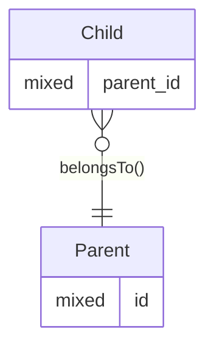

<!-- TOC -->

- [One-to-many](#one-to-many)
    - [Forward Relationship](#forward-relationship)
        - [ER Diagram](#er-diagram)
        - [Relationship Method](#relationship-method)
    - [Reverse Relationship](#reverse-relationship)
        - [ER Diagram](#er-diagram-1)
        - [Relationship Method](#relationship-method-1)
        - [Variations](#variations)

<!-- /TOC -->

# One-to-many

## Forward Relationship

### ER Diagram



### Relationship Method

```php
<?php

use Illuminate\Database\Eloquent\Collection;
use Illuminate\Database\Eloquent\Relations\HasMany;

/** @property Collection<Child> $children */
class Parent extends Model
{
    public function children(): HasMany
    {
        return $this->hasMany(Child::class);
    }
}
```

## Reverse Relationship

### ER Diagram



### Relationship Method

```php
<?php

use Illuminate\Database\Eloquent\Collection;
use Illuminate\Database\Eloquent\Relations\BelongsTo;

/** @property Parent $parent */
class Child extends Model
{
    public function parent(): BelongsTo
    {
        return $this->belongsTo(Parent::class);
    }
}
```

### Variations

* The relationship back go the parent may be optional, though seldom will be.
