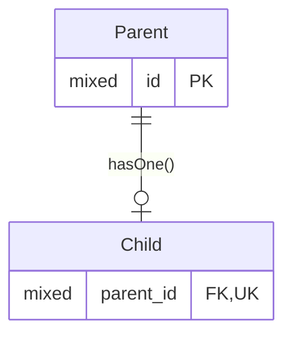
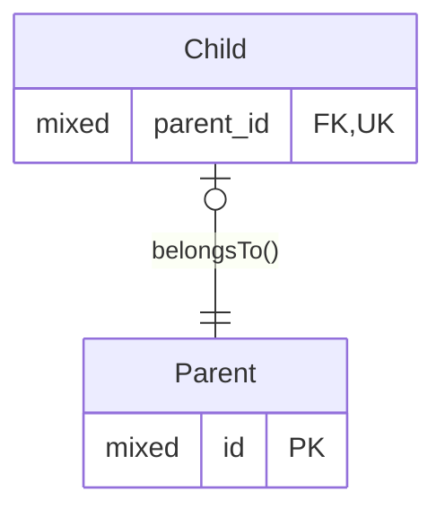
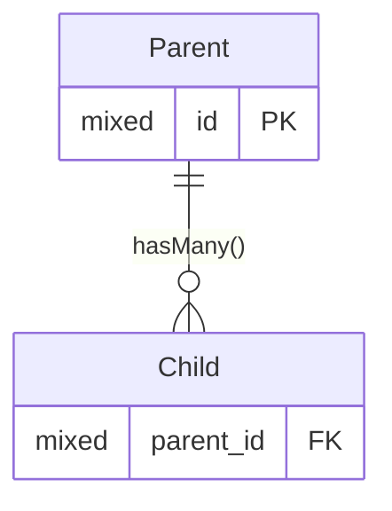
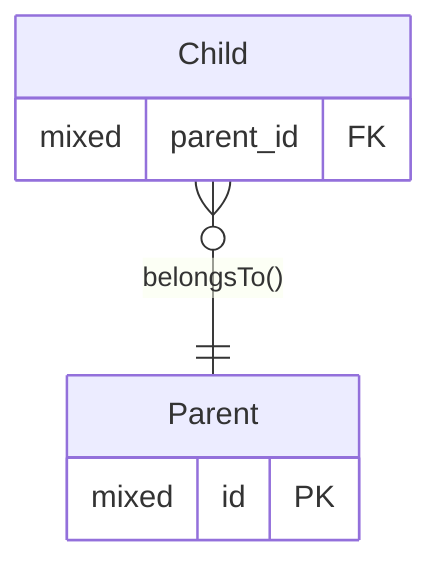

<!-- TOC -->

- [One-to-one](#one-to-one)
    - [Forward Relationship (one-to-one)](#forward-relationship-one-to-one)
        - [ER Diagram (one-to-one forward)](#er-diagram-one-to-one-forward)
        - [Relationship Method (one-to-one forward)](#relationship-method-one-to-one-forward)
    - [Inverse Relationship (one-to-one)](#inverse-relationship-one-to-one)
        - [ER Diagram (one-to-one inverse)](#er-diagram-one-to-one-inverse)
        - [Relationship Method (one-to-one inverse)](#relationship-method-one-to-one-inverse)
- [One-to-many](#one-to-many)
    - [Forward Relationship (one-to-many)](#forward-relationship-one-to-many)
        - [ER Diagram (one-to-many forward)](#er-diagram-one-to-many-forward)
        - [Relationship Method (one-to-many forward)](#relationship-method-one-to-many-forward)
    - [Inverse Relationship (one-to-many)](#inverse-relationship-one-to-many)
        - [ER Diagram (one-to-many inverse)](#er-diagram-one-to-many-inverse)
        - [Relationship Method (one-to-many inverse)](#relationship-method-one-to-many-inverse)
        - [Variations](#variations)

<!-- /TOC -->

# One-to-one

* This relationship is not as symetrical as it sounds,
  as there is still a parent and a child entity.
  The parent instance must exist before a child can be linked to it.
* The database implements a one-to-mamy relationship for a one-to-one
  model relationship.
  Care must be taken with the data integrity to ensure the one-to-one
  relatioship holds.
  A unique index can ensure no parent instance has more than one child.
  *I'm not sure the need to create a unique key is actually documented.*
* The relationship can be set up so that a child can only exist with
  a parent (a `not null` foreign key), or it can be set up so
  a child can exist without a parent (a `nullable` foreign key).
  This second option is more symetrical, since an instance on either
  side of the relationship can exist without a matching instance on
  the other side.

## Forward Relationship (one-to-one)

### ER Diagram (one-to-one forward)



### Relationship Method (one-to-one forward)

```php
<?php

use Illuminate\Database\Eloquent\Collection;
use Illuminate\Database\Eloquent\Relations\HasOne;

/** @property Child|null $child */
class Parent extends Model
{
    public function child(): HasOne
    {
        return $this->hasOne(Child::class);
    }
}
```

## Inverse Relationship (one-to-one)

### ER Diagram (one-to-one inverse)


### Relationship Method (one-to-one inverse)

```php
<?php

use Illuminate\Database\Eloquent\Relations\HasMany;

/** @property Parent $parent if the forign key is not null */
/** @property Parent|null $parent if the forign key is nullable */
class Child extends Model
{
    public function parent(): BelongsTo
    {
        // Omit the second parameter if this method name matches
        // the database foreign key column.

        return $this->belongsTo(Parent::classm, 'parent_id');
    }
}
```

# One-to-many

* A column type of `mixed` will generally be a big [unsigned] integer,
  or a string holding a UUID.
  So long as they are consistent between the entities,
  they either will work.
* The `id` column is the default that Laravel uses for the primary key.
  Any name can be used, for example `uuid` to make it clear what data type
  the primary key uses.
  The foreign keys would be named appropriately in this case, for example `parent_uuid`.

## Forward Relationship (one-to-many)

### ER Diagram (one-to-many forward)



### Relationship Method (one-to-many forward)

```php
<?php

use Illuminate\Database\Eloquent\Collection;
use Illuminate\Database\Eloquent\Relations\HasMany;

/** @property Collection<Child> $child */
class Parent extends Model
{
    public function children(): HasMany
    {
        return $this->hasMany(Child::class);
    }
}
```

## Inverse Relationship (one-to-many)

### ER Diagram (one-to-many inverse)



### Relationship Method (one-to-many inverse)

```php
<?php

use Illuminate\Database\Eloquent\Collection;
use Illuminate\Database\Eloquent\Relations\BelongsTo;

/** @property Parent $parent */
class Child extends Model
{
    public function parent(): BelongsTo
    {
        // The second parameter can be omitted if the first part
        // is the same as this method name, as it is here.

        return $this->belongsTo(Parent::class, 'parent_id');
    }
}
```

### Variations

* The relationship back to the parent may be optional.
* The `BelongsTo` method name is used to derive the foreign key column name.
