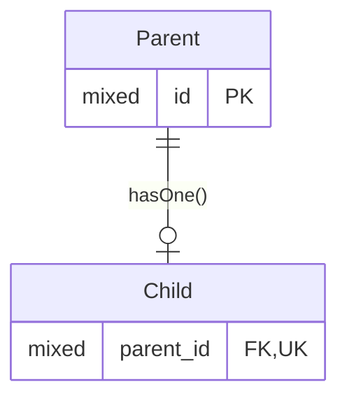
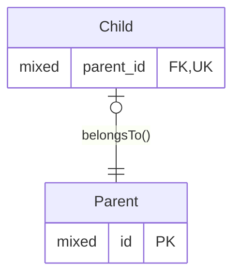

# One-to-one

* This relationship is not as symetrical as it sounds,
  as there is still a parent and a child entity.
  The parent instance must exist before a child can be linked to it.
* The database implements a one-to-mamy relationship for a one-to-one
  model relationship.
  Care must be taken with the data integrity to ensure the one-to-one
  relatioship holds.
  A unique index can ensure no parent instance has more than one child.
  *I'm not sure the need to create a unique key is actually documented.*
* The relationship can be set up so that a child can only exist with
  a parent (a `not null` foreign key), or it can be set up so
  a child can exist without a parent (a `nullable` foreign key).
  This second option is more symetrical, since an instance on either
  side of the relationship can exist without a matching instance on
  the other side.

## Forward Relationship

### ER Diagram



### Relationship Method

```php
<?php

use Illuminate\Database\Eloquent\Collection;
use Illuminate\Database\Eloquent\Relations\HasOne;

/** @property Child|null $child */
class Parent extends Model
{
    public function child(): HasOne
    {
        return $this->hasOne(Child::class);
    }
}
```

## Inverse Relationship

### Inverse ER Diagram


### Inverse Relationship Method

```php
<?php

use Illuminate\Database\Eloquent\Relations\HasMany;

/** @property Parent $parent if the forign key is not null */
/** @property Parent|null $parent if the forign key is nullable */
class Child extends Model
{
    public function parent(): BelongsTo
    {
        // Omit the second parameter if this method name matches
        // the database foreign key column.

        return $this->belongsTo(Parent::classm, 'parent_id');
    }
}
```
